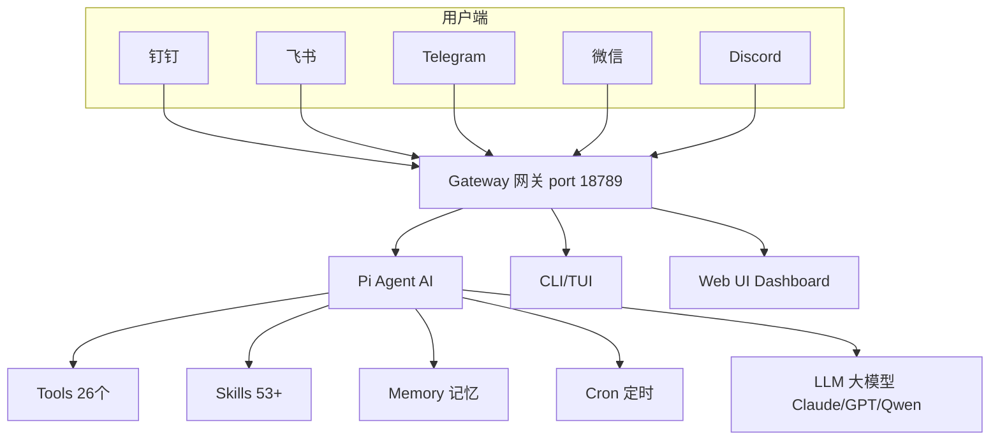
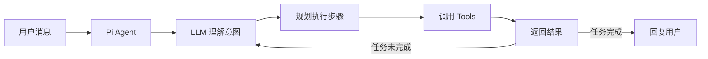
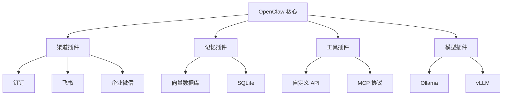
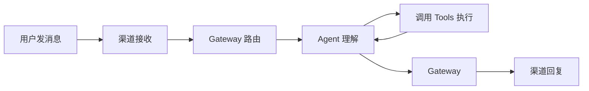

# 第2章·第1节：架构设计

> 理解 OpenClaw 的整体架构，从全局视角看清它是如何工作的。

---

## 整体架构图



---

## 核心组件

### 1. Gateway（网关）
- **角色**：整个系统的中枢
- **功能**：接收来自各渠道的消息，路由到正确的 Agent
- **端口**：默认 18789
- **特点**：一个 Gateway 进程同时服务所有渠道

### 2. Pi Agent



（AI 代理）
- **角色**：AI "大脑"
- **功能**：理解用户意图，规划执行步骤，调用工具完成任务
- **核心**：内置 RPC 模式运行，支持工具调用

### 3. Tools（工具层 - 26 个）
- **角色**：Agent 的"手和脚"
- **类比**：Tools 决定 AI **能不能**做某件事
- **示例**：`read`（读文件）、`exec`（执行命令）、`web_search`（搜索）

### 4. Skills（技能层 - 53+ 内置）
- **角色**：Agent 的"培训教材"
- **类比**：Skills 教 AI **怎么做**某件事
- **示例**：`obsidian`（笔记管理）、`gog`（Google 服务）

### 5. Memory + ContextEngine（记忆系统）
- **角色**：长期记忆存储
- **功能**：跨会话记住用户偏好和上下文
- **v2026.3.7 新增**：ContextEngine 可插拔上下文引擎，自动管理记忆的保存/检索/压缩

### 6. Channels（渠道层）
- **角色**：用户接入点
- **支持**：Telegram、Discord、WhatsApp、钉钉、飞书、企微、微信（WorkBuddy）、QQ 等

---

## 插件扩展架构

OpenClaw 的设计哲学是**开放扩展、不改核心**。通过插件在四个方向扩展：

| 插件类型 | 说明 | 示例 |
|----------|------|------|
| **渠道插件** | 添加新聊天平台 | 钉钉、飞书、企业微信 |
| **记忆插件** | 换存储后端 | 向量数据库替代 SQLite |
| **工具插件** | 添加自定义能力 | 自定义 API 调用 |
| **模型插件** | 接入自定义模型 | Ollama、vLLM |



---

## 数据流向



**详细流程**：

1. 用户在钉钉发送 "帮我查今天的天气"
2. 钉钉插件收到消息，转发给 Gateway
3. Gateway 识别发送者身份和会话上下文
4. 消息传递给 Pi Agent
5. Agent 调用 LLM 分析意图
6. LLM 决定使用 `web_search` 工具
7. Agent 执行搜索，获取天气数据
8. LLM 将结果整理为友好的回复
9. Agent 通过 Gateway 将回复发回钉钉
10. 用户收到天气信息

---

## 文件系统布局

```
~/.openclaw/                    # OpenClaw 主目录
├── openclaw.json               # 全局配置文件
├── agents/                     # Agent 数据
│   └── main/                   # 主 Agent
│       ├── sessions/           # 会话记录 (JSONL)
│       └── workspace/          # 工作空间
│           ├── SOUL.md         # Agent 人格定义
│           ├── USER.md         # 用户信息
│           ├── AGENTS.md       # Agent 列表
│           ├── HEARTBEAT.md    # 心跳配置
│           └── memory/         # 记忆存储
├── skills/                     # 用户安装的 Skills
├── plugins/                    # 插件
└── logs/                       # 日志
```

---

## 下一节

👉 [02-网关系统](02-gateway.md) — 深入了解 Gateway
