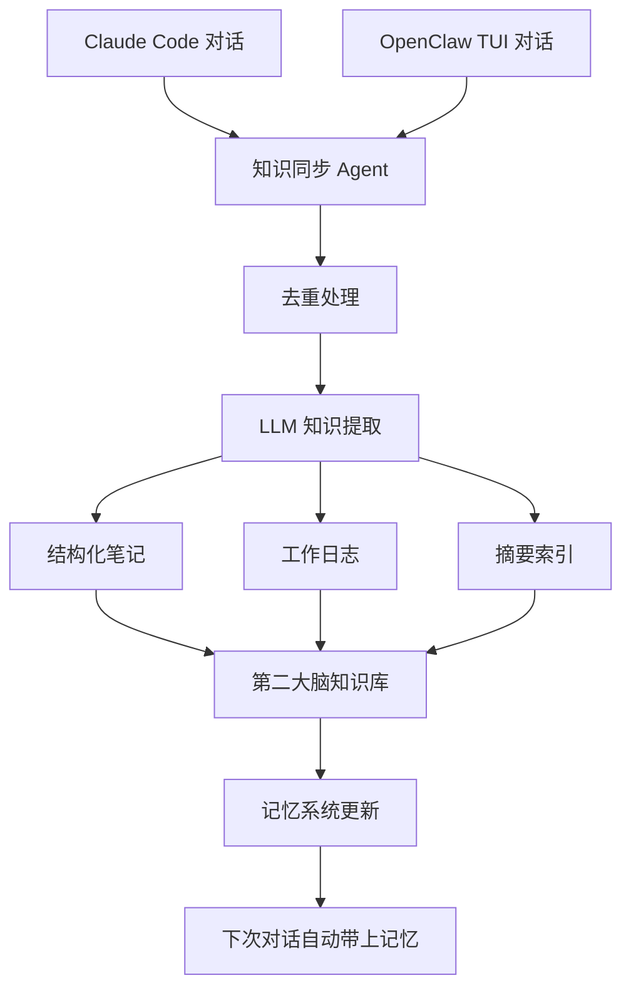

# 第7章·第2节：第二大脑知识系统

> 把 OpenClaw 打造成你的个人知识管理系统，自动捕获、提取、索引你的所有对话和笔记。

---

## 项目概览

**openclaw-second-brain** 是社区中最经典的 OpenClaw 应用之一。核心理念：你和 AI 的每一次对话都是知识，不该被遗忘。

它能自动：
1. 捕获 OpenClaw TUI 和 Claude Code 的对话记录
2. 通过 LLM 驱动的流水线做摘要和知识提取
3. 生成结构化的知识笔记和日志
4. 维护一套统一的记忆系统
5. 通过 Cron 自动运行研究和知识同步任务



---

## 技术栈

| 组件 | 技术 | 说明 |
|------|------|------|
| 运行时 | Node.js 22+ | OpenClaw 基础环境 |
| 笔记存储 | Obsidian / Markdown | 纯文本，方便检索和版本管理 |
| 知识图谱 | D3.js（可选） | Web 可视化界面 |
| AI 模型 | qwen3.5-plus（主力） | 性价比最高，1M 上下文 |
| 嵌入模型 | SiliconFlow bge-m3 | 免费语义搜索 |
| 进程管理 | systemd / pm2 | 保持 Agent 持续运行 |

---

## 三大核心 Agent

### Agent 1：知识同步（每小时）

每小时自动扫描新的对话记录，提取关键信息：

```bash
# 添加 Cron 任务
openclaw cron add \
  --name "Knowledge Sync" \
  --cron "0 * * * *" \
  --tz "Asia/Shanghai" \
  --session isolated \
  --message "扫描 ~/.openclaw/agents/main/sessions/ 中最近一小时的新会话。
对每个新会话：
1. 提取关键结论、决策和代码片段
2. 生成结构化笔记，保存到 ~/obsidian/Notes/$(date +%Y-%m-%d)-auto.md
3. 如果有新的技术知识点，追加到 ~/obsidian/Knowledge/tech-notes.md
4. 更新 MEMORY.md 中的索引
跳过已处理的会话（检查 .processed 标记）。"
```

工作流程：
1. 扫描 OpenClaw 和 Claude Code 的会话目录
2. 找到未处理的新对话（检查 `.processed` 标记文件）
3. 调用 LLM 提取关键信息、结论和代码片段
4. 生成结构化笔记，按日期保存
5. 更新知识索引

### Agent 2：研究助手（每日）

每天根据你最近的对话主题自动做延伸研究：

```bash
openclaw cron add \
  --name "Daily Research" \
  --cron "0 9 * * *" \
  --tz "Asia/Shanghai" \
  --session isolated \
  --message "分析最近 7 天的对话记录和笔记：
1. 提取最近讨论最多的 3 个话题
2. 对每个话题，用 web_search 搜索最新的博客、教程和 GitHub 项目
3. 生成研究报告，保存到 ~/obsidian/Research/$(date +%Y-%m-%d)-report.md
4. 如果发现和我之前的结论有矛盾的新信息，在 Discord #alerts 频道通知我"
```

### Agent 3：社区调研（按需触发）

直接在对话中触发：

```
# 实际对话示例
你：帮我调研一下 Cursor 和 Copilot 的对比

Agent 的行为：
1. 在 Twitter、Reddit、HackerNews 并行搜索
2. 收集真实用户评价和性能对比
3. 整理出 优势/劣势/适用场景 对比表
4. 保存完整报告到 Obsidian，聊天中给出精简摘要
```

| 调研类型 | 说明 |
|---------|------|
| 趋势分析 | 搜索近 3 个月讨论，分析热度变化 |
| 工具对比 | 收集真实用户评价，输出对比表格 |
| 最佳实践 | 搜索实战经验和代码示例 |
| 社区观点 | 分析共识点和争议点 |

---

## 记忆系统架构

系统使用 4 层记忆架构：

| 层级 | 持久性 | 内容 | 存储位置 |
|------|-------|------|---------|
| 用户偏好 | 长期 | 姓名、习惯、沟通风格 | USER.md |
| 决策历史 | 中期 | 过去的选择和项目决策 | memory/decisions.md |
| 技术知识 | 中短期 | 学到的概念、代码模式 | memory/tech-*.md |
| 对话历史 | 短期 | 最近的交互记录 | sessions/*.jsonl |

开启语义搜索（推荐）：

```json
{
  "tools": {
    "memorySearch": {
      "enabled": true,
      "embedding": {
        "provider": "openai-compatible",
        "baseUrl": "https://api.siliconflow.cn/v1",
        "apiKey": "你的SiliconFlow-Key",
        "model": "BAAI/bge-m3"
      }
    }
  }
}
```

> SiliconFlow 提供免费的 Embedding API，注册即用。

---

## 生产环境经验

### Tip 1：日志记结论，不记过程

```markdown
### [PROJECT:MyApp] 部署完成
- **结论**：通过 nginx 部署在 80 端口
- **改动文件**：/etc/nginx/sites-available/myapp
- **教训**：直接暴露端口不行，必须走反向代理
- **标签**：#myapp #部署 #nginx
```

> "用 nginx 部署在 80 端口"比"调了半天 bug 终于搞定了"有用 100 倍。

### Tip 2：MEMORY.md 保持精简

```bash
# 检查记忆文件大小（应该 < 40 行）
wc -l ~/.openclaw/workspace/MEMORY.md
```

MEMORY.md 是索引，不是存储。放指针，不放内容。

### Tip 3：每周自动维护

在 HEARTBEAT.md 里加上：

```markdown
## 记忆维护
- 每周日 03:00：
  1. MEMORY.md 去重
  2. 归档 30 天前的日志
  3. 检查 projects.md 是否与实际一致
```

### Tip 4：保护好敏感文件

```gitignore
.openclaw/
**/auth-profiles.json
.env
.env.local
*.key
*.pem
```

---

*上一节：[章节概览](01-overview.md) | 下一节：[每日简报 →](03-daily-briefing.md)*
