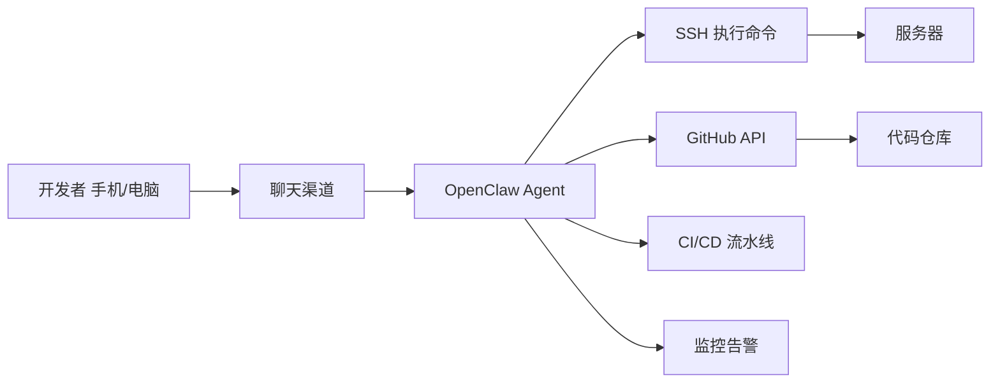

# 第7章·第4节：开发运维自动化

> 用手机上的聊天工具管理服务器、部署代码、监控告警。开发者最爱的 OpenClaw 应用。

---

## 场景

你是一个独立开发者或小团队成员，没有专职运维。服务器出问题了，你希望能在手机上直接排查和修复，而不是打开电脑、SSH 进去敲命令。

OpenClaw 让你做到这一点——**在钉钉/Telegram 里直接操作服务器**。



---

## 场景一：手机上写代码和部署

社区里最酷的用例之一——在通勤路上用手机写代码：

```
你（在地铁上，用钉钉）：
  帮我在 api/routes/user.js 里加一个 GET /api/user/stats 接口，
  返回用户的注册天数和总消息数。写完跑一下测试。

Agent：
  ✅ 已修改 api/routes/user.js，新增 GET /api/user/stats
  ✅ 测试结果：12 passed, 0 failed
  需要我提交并部署到 staging 吗？

你：部署吧

Agent：
  ✅ 已提交：feat: add user stats endpoint
  ✅ 已推送到 staging 分支
  ✅ CI/CD 流水线已触发，预计 3 分钟完成
  我会在部署完成后通知你。
```

### 关键配置

确保开启了 `exec` 和 `github` 工具：

```json
{
  "tools": {
    "exec": { "enabled": true },
    "github": { "enabled": true }
  }
}
```

---

## 场景二：自动更新和备份

社区推荐的 "自我维护" 套件——让 OpenClaw 自己照顾自己：

### 每日自动更新（凌晨 4:00）

```bash
openclaw cron add \
  --name "Self Update" \
  --cron "0 4 * * *" \
  --tz "Asia/Shanghai" \
  --session isolated \
  --message "执行 OpenClaw 自动更新：
1. 运行 openclaw update 更新到最新版
2. 重启 Gateway
3. 检查更新后所有渠道是否正常连接
4. 在 Discord #monitoring 频道报告：更新了什么版本，是否有异常"
```

### 每日配置备份到 GitHub（凌晨 4:30）

```bash
openclaw cron add \
  --name "Config Backup" \
  --cron "30 4 * * *" \
  --tz "Asia/Shanghai" \
  --session isolated \
  --message "备份所有关键配置到 GitHub 私有仓库：

需要备份的文件：
- SOUL.md、MEMORY.md 和所有记忆文件
- 所有 Cron 任务定义
- 所有 Skill 配置
- Gateway 配置文件
- 工作空间的所有自定义文件

备份前：
1. 扫描所有文件，查找泄露的密钥（API Key、Token、密码）
2. 用描述性占位符替换：[DASHSCOPE_API_KEY]、[DISCORD_TOKEN] 等
3. 提交并推送到私有仓库

完成后在 #monitoring 频道发一行确认。"
```

---

## 场景三：服务器监控和故障自愈

### 每 30 分钟健康检查

```bash
openclaw cron add \
  --name "Server Health" \
  --cron "*/30 * * * *" \
  --tz "Asia/Shanghai" \
  --session isolated \
  --message "服务器健康检查（静默模式，只在异常时通知）：

1. 检查 CPU 使用率（告警阈值：>80%）
2. 检查内存使用率（告警阈值：>85%）
3. 检查磁盘空间（告警阈值：>90%）
4. 检查核心服务是否运行（nginx、node、redis）
5. 检查 SSL 证书有效期（告警阈值：<7天）

如果发现异常：
- 磁盘满了：自动清理 Docker 无用镜像和日志（docker system prune）
- 服务挂了：尝试自动重启一次
- 其他异常：在 Telegram 上通知我，附上诊断信息

没有异常就不要发消息。"
```

### 实际告警效果

```
🔴 服务器告警 | 03:14
磁盘使用率 92%（/dev/sda1）

已自动清理：
- Docker 无用镜像：释放 2.3GB
- 旧日志文件（>30天）：释放 800MB
- 当前磁盘使用率：71% ✅

如果磁盘持续增长，建议扩容或检查日志轮转配置。
```

---

## 场景四：PR 审查助手

让 Agent 帮你审查代码：

```
你：帮我看一下 PR #42 有什么问题

Agent：
我检查了 PR #42 (feat: add payment integration)，发现以下问题：

🔴 严重
1. payment.js:L45 - API Key 硬编码在源码中，应该用环境变量
2. payment.js:L78 - 缺少错误处理，支付失败时会导致 500 错误

🟡 建议
3. payment.js:L23 - 建议加上金额校验（防止负数）
4. test/payment.test.js - 缺少支付失败场景的测试用例

需要我起草修复代码吗？
```

---

## 安全注意事项

| 操作 | 权限建议 |
|------|---------|
| 读取日志/状态 | 允许自动执行 |
| 重启服务 | 允许自动执行 |
| 修改配置 | 需要你确认 |
| 删除文件/数据 | 必须你确认 |
| 部署到生产 | 必须你确认 |

在 AGENTS.md 中设定安全边界：

```markdown
## 安全规则
- 可以自动执行的：查看日志、检查状态、运行测试、清理缓存
- 需要确认的：修改配置文件、部署代码、删除任何东西
- 绝对禁止的：未经确认修改生产数据库、暴露任何凭证
```

---

*上一节：[每日简报](03-daily-briefing.md) | 下一节：[内容研究与写作流水线 →](05-content-pipeline.md)*
